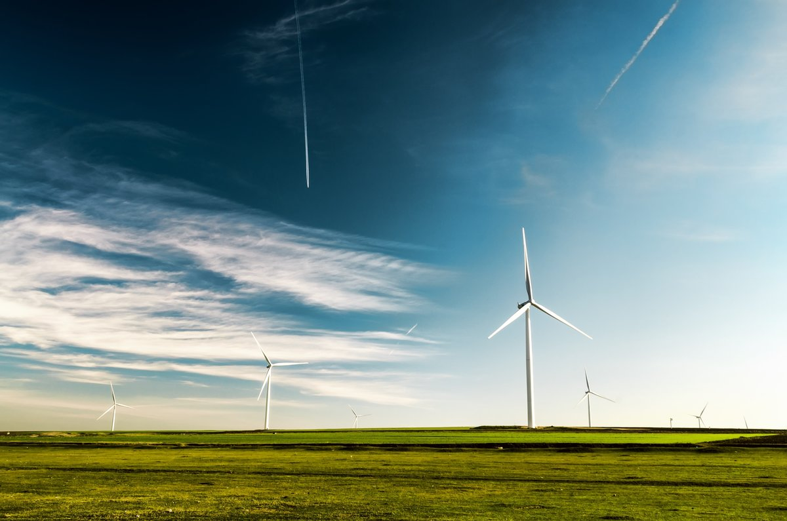

---
author:
- Guido Pleßmann
- Jann Launer
- Matthias Laugwitz
short-author: 
- Guido Pleßmann
title: The RLI \LaTeX{} beamer theme
subtitle: ...finally overcoming MS Powerpoint
institute: Reiner Lemoine Institut
classoption: aspectratio=169
date: \today
theme: rli
header-includes:
- |
  \newcommand{\tel}{+49 (0)30 1208 434 72}
  \newcommand{\email}{guido.plessmann@rl-institut.de}
  \newcommand{\twitter}{\href{https://twitter.com/gplssm}{@gplssm}}
  \newcommand{\finalstatement}{Enjoy stating a final statement ;-)}
---

# A new frame

Create a new frame with title and content

~~~ markdown
# A new frame

With content in it's body.
~~~

# Use images

\center
{ width=75% }

# Use lists and enumerated lists

- item a
  - item a.1
    - item a.1.a
    - item a.1.b
	
#. item 1
   #. item a
#. item 2
#. item 3
   - mix
   - it

# Descriptions

\begin{description}[A]
  \item[Distributed Energy Resource] Electrical power generation or storage located at or near the point of use, as well as demand side measures.
  \item[Distributed Generation] Electric power generation located at or near the point of use.
  \item[Distributed Power] Electrical power generation or storage located at or near the point of use.
\end{description}

Content stolen from [ACEEE glosarry](https://aceee.org/glossary_data).

# Presenting code

~~~ python
import requests
import pandas as pd
from tabulate import tabulate

df = pd.DataFrame(requests.get('http://openenergy-platform.org/api/v0\
  /schema/supply/tables/bnetza_eeg_anlagenstammdaten/rows/?limit=100').json())

df = df[[
  '4.11_bundesland',
  '4.1_energieträger', 
  '4.2_installierte_leistung',
  '4.16_name_des_netzbetreibers']]
df.columns = ["Federal state", "Technology", "Inst. Power", "Grid operator"]

print(tabulate(df.head(10), tablefmt="pipe", headers="keys"))
~~~

# Tables

|    | Federal state       | Technology   |   Inst. Power | Grid operator                       |
|---:|:--------------------|:-------------|--------------:|:------------------------------------|
|  0 | Niedersachsen       | Biomasse     |           366 | Avacon AG                           |
|  1 | Bayern              | Biomasse     |           380 | Bayernwerk AG                       |
|  2 | Bayern              | Wasserkraft  |             6 | Bayernwerk AG                       |
|  3 | Hessen              | Biomasse     |           380 | EnergieNetz Mitte GmbH              |
|  4 | Bayern              | Wind Land    |          3050 | Bayernwerk AG                       |
|  5 | Nordrhein-Westfalen | Biomasse     |           400 | Westfalen Weser Netz GmbH           |
|  6 | Nordrhein-Westfalen | Biomasse     |          1200 | Westfalen Weser Netz GmbH           |
|  7 | Schleswig-Holstein  | Wind Land    |          2000 | Schleswig-Holstein Netz AG          |
|  8 | Hessen              | Biomasse     |           400 | EnergieNetz Mitte GmbH              |
|  9 | Bayern              | Biomasse     |          1000 | MDN Main-Donau Netzgesellschaft mbH |

# Blocks

\begin{block}{Title}
Here you can put your content
\end{block}

in Markdown you simply use

``` markdown
## Markdown block header

Markdown block content
```

to achieve the same, see

## Markdown block header

Markdown block content


# Using the default last slide

## Latex

``` latex
\begin{frame}[plain]{}

\insertendpagecontent

\end{frame}
```

## Markdown

``` markdown
# {.plain}

\insertendpagecontent
```
# Information must be provided in markdown header

Requires the following \LaTeX{} code in `- header-includes`

~~~ latex
---
header-includes:
- |
  \newcommand{\tel}{+49 (0)30 1208 434 72}
  \newcommand{\email}{guido.plessmann@rl-institut.de}
  \newcommand{\twitter}{\href{https://twitter.com/gplssm}{@gplssm}}
  \newcommand{\finalstatement}{Enjoy stating a final statement ;-)}
---
~~~

# Find help

- Pandoc manual: [https://pandoc.org/MANUAL.html](https://pandoc.org/MANUAL.html)


# {.plain}

\insertendpagecontent
